### About Me

* Computer Engineering student
* Python & Backend Development
* Data & Machine Learning
* Linux, Automation & APIs
* Currently focused on software engineering

## Stats

  
  

    

  

